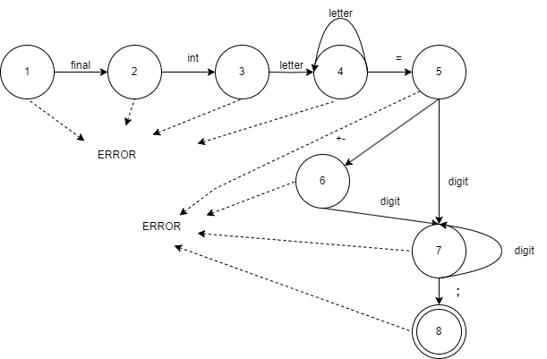
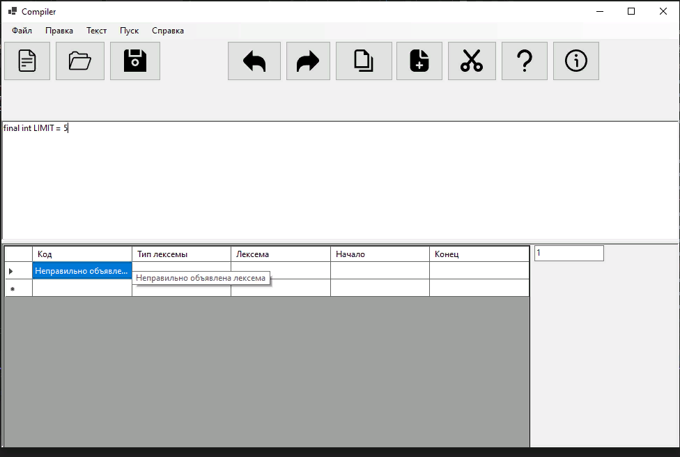
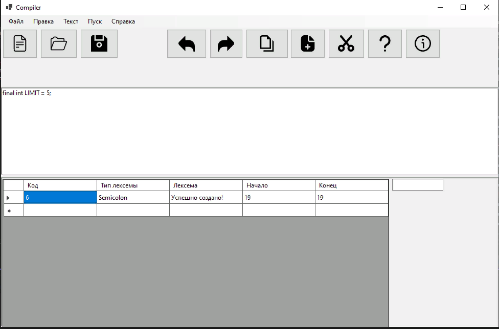

<html>

<head>
    <h1>Вариант задания: Объявление целочисленной константы с инициализацией на языке Java</h1>
    
    </head>

    <body>

Примеры верных строк:

 final int LIMIT =5; 

Разработанная грамматика:

1) DEF -> final FINAL

2) FINAL -> int INT

3) INT -> letter ID

4) ID -> letter ID | "=" ASSIGNTMENT

5) ASSIGNTMENT -> ['+' | '-'] SIGN

6) SIGN -> digit NUMBER

7) NUMBER -> digit NUMBER | ";"

Классификация грамматики

 Автоматная

Граф конечного автомата

тестовые примеры

    </body>

</html>