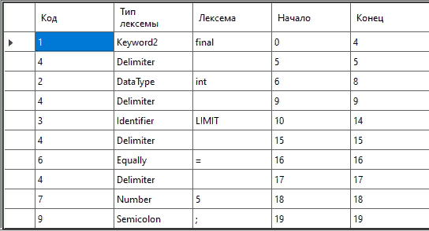

<html>

<head>
    <h1>Цель: Изучить назначение лексического анализатора. Спроектировать алгоритм и выполнить программную реализацию сканера.</h1>
    <h2>Вариант: Объявление целочисленной константы с инициализацией на языке Java</h2>
    </head>

    <body>

Примеры верных строк:

Тестовые примеры:

    </body>

</html>
